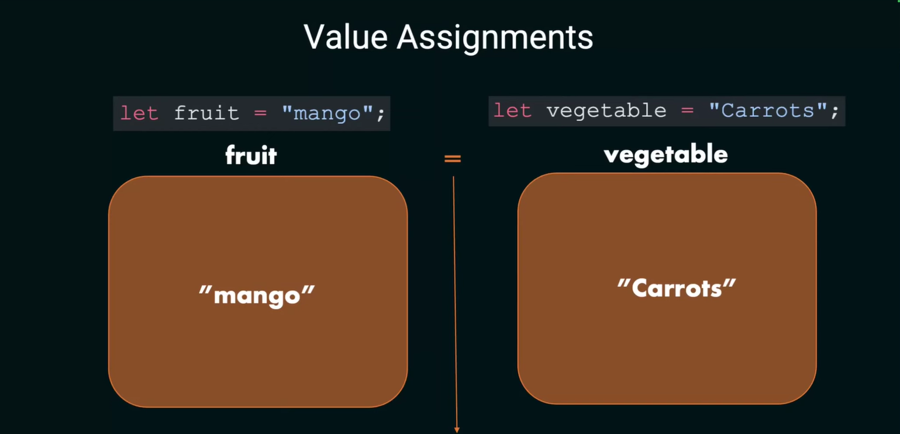
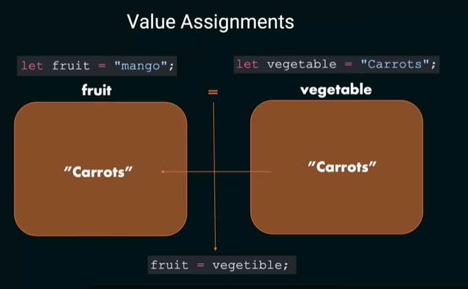
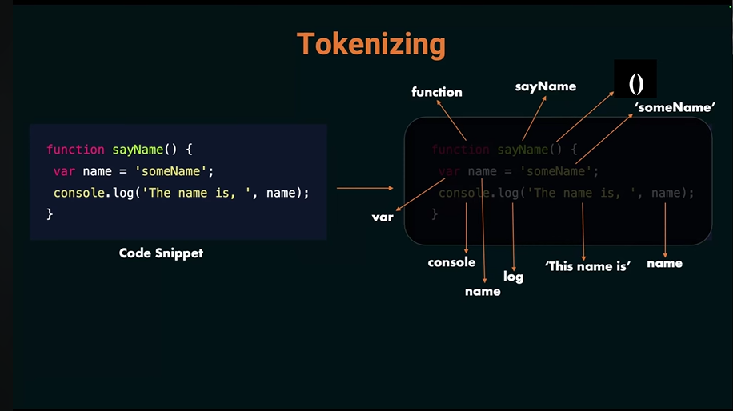
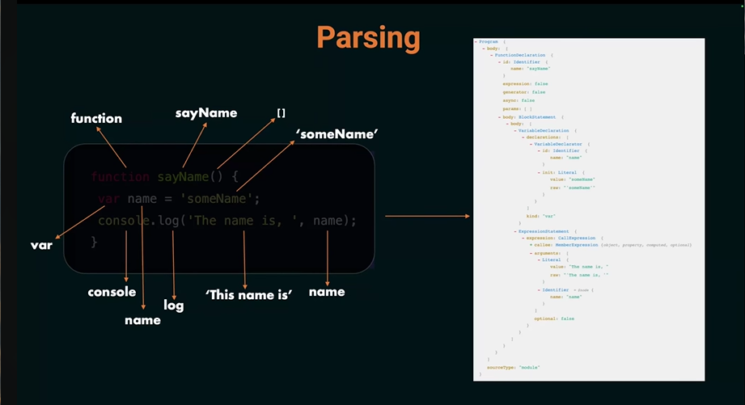
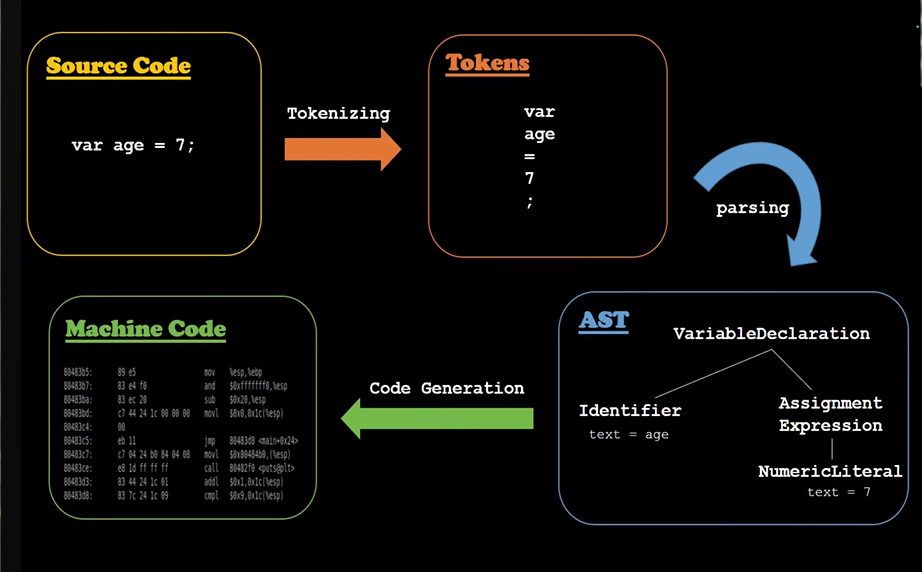

Value Assignment:
  

  2 Type of Values:
    1) Primitive Values - basic values like number, string, boolean
    2) Non-Primitive Values - are the advance of the complex values that we build using the primitive values like functions, objects, arrays.

    Primitive Values --> pass by value.
    Non-Primitive Values --> pass by reference.

  NOTE: 
    1) For any primitive value the value when you do the assignment is pass by value or pass by references.
    2) Javascript string is a primitive value. which is pass by value it means when you assign to variables your right side variables value is passed to your left side storage.
    
    ex) fruit = vegetable  
      - nothing will change on the vegetable variable the only thing will happen is on the left side assignment which is the fruit variable this is called --> pass by value, and only can happen in primitive kind of data type.

Naming Convention: 
  * The name must have digits[0-9] or letters
  * The name can have $ and _
  * The first character must not be a digit
  * No reserved keywords
    ex) 
    - let $ = 'dollar' ✅
    - let 2morrow; ❌
    - let _ = 'underscore'; ✅
    - let react-play; ❌

    Variable Name Standards: 
    * Use camelCase
    * Human Readable
    * The name should match the usecase or cause.

Variables: 
  var : function-scopeed, can be redeclared (not recommended).
    - You can only redeclare variables once.
    - You can assign value to your variabes as many times you want.
  let: block-scoped, can be reassigned.
  const: block-scoped, cannot be reassigned.

Primitive and Non-Primitive Data Types: 
  Primitive Data Types: 
  - String -> Text Values ('Hello') 
  - Number -> Numberic Values ('25', '3.14')
  - Boolean -> True/False ('true', 'false')
  - Undefined -> A variable declared but not assigned anything. ('let x;')
  - Null -> represents nothing ('let y = null';)
  - BigInt -> large numbers ('BigInt(1234567890)')
  - Symbol -> Unique Identifiers ('Symbol('id'))
  Non-Primitive Data Types: 
  - Object -> collection of key-value pairs
  - Array -> ordered list of values
  - Function -> code that can be executed

Variables in Memory: 
  - In programming, the program uses memory in that memory only its going to store and is going to save the information without storing it into the memory it cannot really reuse those information later point in time.

  2 Types of Memory at a High Level:
  1) Stack: 
  - Where primitive data types are stored.

  2) Discrete memory/Heap - 
  - Where reference data type or non-primitive data types are stored. The value of that will be stored into the heap.
  
  NOTE: 
  - Each memory location will have a unique memory address.

  How Variables and data stored in the memory? (Primitive and Non-Primitive but a higher level).
  - 

How JavaScript See Code?
  In High Level: 
  1) Tokenizing 
  - 
  2) Parsing
  - 
  3) Interpreting
  - 
  4) Generation (not include in High Level)