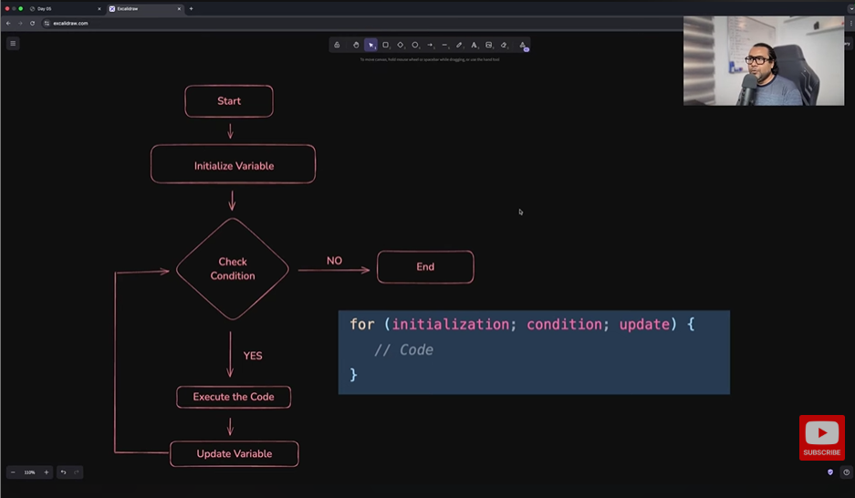

Looping is called iteration 
    - For Loop: when we know exactly how many times we need to run a block of code.
        example: for (initialization; condition; update)
        - initialization -> tells how are you going to start this loop from where you want to start the loop.
        - condition -> says based on which condition you want to run this loop based on which condition you want to run the loop
        - update -> says that how do you want to update the value that you initialize you started with so that your loop can move forward.

    - While Loop: if you dont know how many times to loop. runs as long as a given condition is true.
    - Do While Loop: which guarantee at least on time looping or one execution.

For Loop Flow Chart: 
    - 

Position vs Number of Elements: 
    - position is always starting with zero
    - number of elements starting with one

Nested Loop: used when you want to work with multi-dimensional data
    - single-dimensional data -> is usually one row 
    - multi-dimensional data -> is like tables, grades, matrix in mathematics where you can row and column.

    NOTE: the outer loop will only increment if the inner loop condition started to become false. its not gonna increment every iteration it waits till the inner loop condition fully met.

Break and Continue:
    - break -> stops the loop immediately whenever it encounters the break keyword
    - continue -> it is skip that particular iteration and go back and go to the next iteration, so if you want to skip the particular iteration and then move to the next iteration. I

Handling Multiple Counters: when you want to use multiple variables in the single loop.

Do-While Loop: ensures that your code executes at least once before you check the condition. run the loop at least once and then we will do the condition checking.