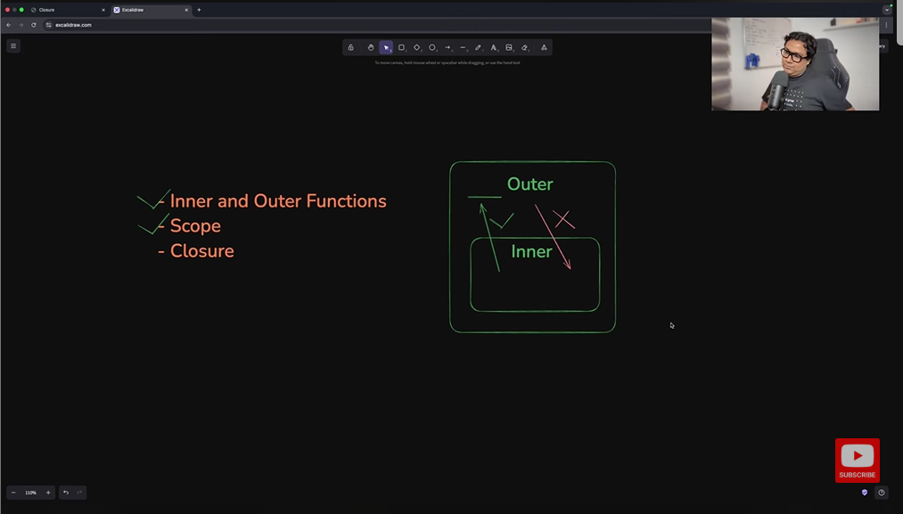

Closure 
1. , variables defined inside an inner function cannot be accessed by the outer function. variables defined inside the outer function can be accessed and used by the inner function.
2. With closure, is a function that can remember the variable from its outer function even after the outer function has executed. 
3. A closure allows a function to access a variable from its outer scope even after the outer scope finished the execution.
4. Closure, always closed on a value of a variable from his outer function thats why its called closure, remembers the variable that was executed from the function.
5. A closure can hold the reference of a variable that is declared in the outer function means its lexical scope as it is holding a reference.

Advantages of Closure
1. You can keep the variables private without exposing them.
2. You can stop variable pollution.
3. You can create a function factory.
4. You can keep a variable alive between multiple calls.